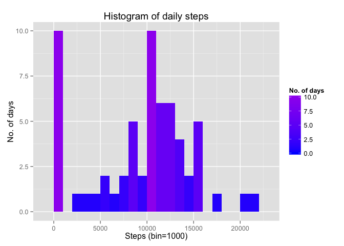
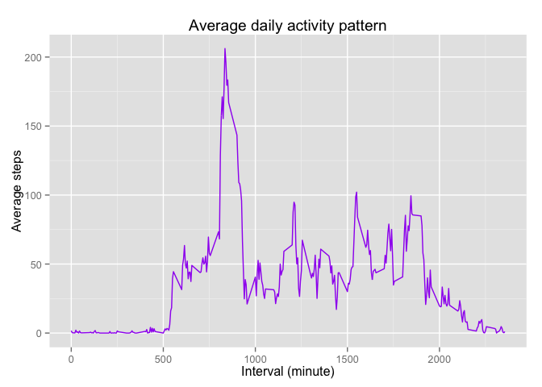
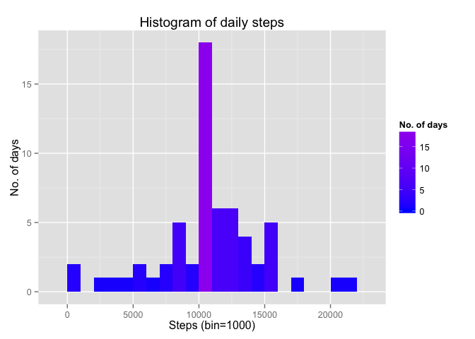
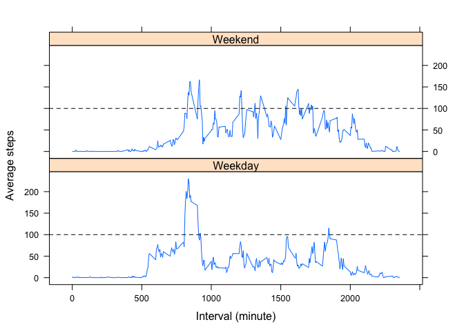

# Reproducible Research: Peer Assessment 1


## Loading and preprocessing the data

```r
library(ggplot2)
library(lattice)
unzip("activity.zip")
activity <- read.csv("activity.csv")
```


## What is mean total number of steps taken per day?
For this part of the assignment, ignore the missing values in the dataset.
1.Calculate the total number of steps taken per day

```r
steps.date <- aggregate(x = activity$steps , by = list(activity$date), FUN = sum, na.rm=TRUE)
names(steps.date) <- c("date","steps")
head(steps.date)
```

```
##         date steps
## 1 2012-10-01     0
## 2 2012-10-02   126
## 3 2012-10-03 11352
## 4 2012-10-04 12116
## 5 2012-10-05 13294
## 6 2012-10-06 15420
```
2.Make a histogram of the total number of steps taken each day

```r
histplot <- ggplot(steps.date,aes(x = steps)) +
            ggtitle("Histogram of daily steps") +
            xlab("Steps (bin=1000)") + ylab("No. of days") +
            geom_histogram(binwidth = 1000,aes(fill = ..count..))+
            scale_fill_gradient("No. of days", low = "blue", high = "purple")
histplot
```

 
3.Calculate and report the mean and median of the total number of steps taken per day

```r
mean(steps.date$steps)
```

```
## [1] 9354.23
```

```r
median(steps.date$steps)
```

```
## [1] 10395
```

## What is the average daily activity pattern?
1.Make a time series plot (i.e. type = "l") of the 5-minute interval (x-axis) and the average number of steps taken, averaged across all days (y-axis)

```r
steps.interval <- aggregate(x = activity$steps , by = list(activity$interval), FUN = mean, na.rm=TRUE)
names(steps.interval) <- c("interval","steps")
avg.step <- ggplot(steps.interval,aes(interval,steps)) +
                 xlab("Interval (minute)") + ylab("Average steps") +
                 ggtitle("Average daily activity pattern") +
                 geom_line(color='purple')
avg.step
```

 
2.Which 5-minute interval, on average across all the days in the dataset, contains the maximum number of steps?

```r
steps.interval$interval[which.max(steps.interval$steps)]
```

```
## [1] 835
```

## Imputing missing values
1.Calculate and report the total number of missing values in the dataset (i.e. the total number of rows with NAs)

```r
sum(is.na(activity))
```

```
## [1] 2304
```
2.fill in all missing values with the mean for the 5-minute interval

```r
activity_merge <- merge(activity, steps.interval, by = "interval")
nas <- is.na(activity_merge$steps.x)
activity_merge$steps.x[nas] <- activity_merge$steps.y[nas]
```
3.Create a new dataset that is equal to the original dataset but with the missing data filled in.

```r
activity_new <- activity_merge[, c(1:3)]
activity_new=activity_new[order(activity_new$date,activity_new$interval),]
activity_new=data.frame(activity_new$steps.x,activity_new$date,activity_new$interval)
names(activity_new) <- c("steps","date","interval")
head(activity_new)
```

```
##       steps       date interval
## 1 1.7169811 2012-10-01        0
## 2 0.3396226 2012-10-01        5
## 3 0.1320755 2012-10-01       10
## 4 0.1509434 2012-10-01       15
## 5 0.0754717 2012-10-01       20
## 6 2.0943396 2012-10-01       25
```

```r
head(activity)
```

```
##   steps       date interval
## 1    NA 2012-10-01        0
## 2    NA 2012-10-01        5
## 3    NA 2012-10-01       10
## 4    NA 2012-10-01       15
## 5    NA 2012-10-01       20
## 6    NA 2012-10-01       25
```
4.1.Make a histogram of the total number of steps taken each day 

```r
steps.date.new <- aggregate(x=activity_new$steps,by=list(activity_new$date), FUN = sum)
names(steps.date.new) <- c("date","steps")
histplot_new <- ggplot(steps.date.new,aes(x = steps)) +
            ggtitle("Histogram of daily steps") +
            xlab("Steps (bin=1000)") + ylab("No. of days") +
            geom_histogram(binwidth = 1000,aes(fill = ..count..))+
            scale_fill_gradient("No. of days", low = "blue", high = "purple")
histplot_new
```

 
4.2.Calculate and report the mean and median total number of steps taken per day

```r
mean(steps.date.new$steps)
```

```
## [1] 10766.19
```

```r
median(steps.date.new$steps)
```

```
## [1] 10766.19
```
These values differ from the estimates from the first part of the assignment. Imputing missing data increases mean and median total number of steps taken per day. This makes sense since by imputing missing data, we generally increase the total number of steps taken per day. Thus, the mean and median total number of steps taken per day are increased as well.

## Are there differences in activity patterns between weekdays and weekends?
1.Create a new factor variable in the dataset with two levels – “weekday” and “weekend” indicating whether a given date is a weekday or weekend day.

```r
activity_new$weekday=weekdays(as.Date(activity_new$date)) 
activity_new$weekday <- as.factor(ifelse(weekdays(as.Date(activity_new$date)) %in% c("Saturday","Sunday"), "Weekend", "Weekday")) 
```
2.Make a panel plot containing a time series plot of the 5-minute interval (x-axis) and the average number of steps taken, averaged across all weekday days or weekend days (y-axis). 

```r
steps.interval.weekday  <- aggregate(x = activity_new$steps, by = list(activity_new$interval, activity_new$weekday), FUN = mean ,na.rm=TRUE)
names(steps.interval.weekday) <- c("interval","weekday","steps")
xyplot(steps~interval | weekday, data = steps.interval.weekday,
      type = 'l',
      xlab = 'Interval (minute)',
      ylab = 'Average steps',
      layout = c(1,2),
      panel = function(x, y, ...) {
        panel.xyplot(x, y, ...) ## First call the default panel function for 'xyplot'
        panel.abline(h = 100.0, lty = 2) ## Add a horizontal line at the median
        })
```

 

There are differences in activity patterns between weekdays and weekends. The dashed horizontal lines indicate average steps of 100. During weekends, there are more intervals with average steps > 100, while during weekdays, there are less intervals with average steps > 100, indicating people are more active during weekends than weekdays.   
